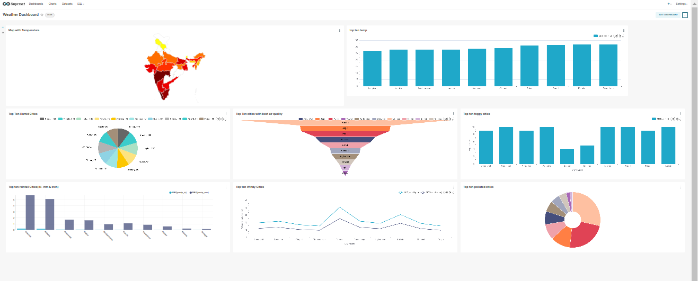
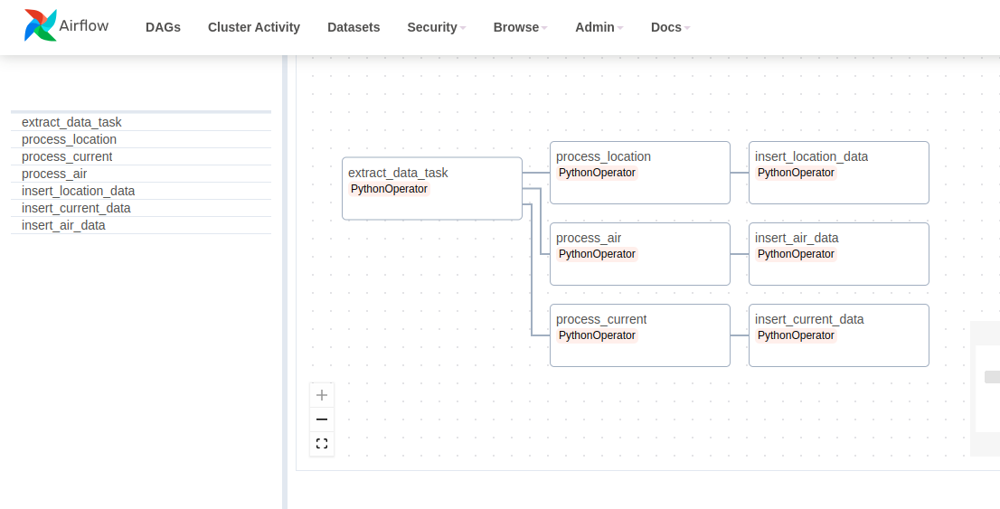

# Weather Dashborard 

```sh
BY: Varun Sharma
```
A dynamic weather dashboard showcasing comprehensive information on rainfall, humidity, and air quality for various states in the country.
- Automated the entire data flow using an ETL framework, minimizing human intervention and enhancing efficiency.
- Integrated Tableau with the Postgres, creating a visually compelling and user-friendly dashboard to provide stakeholders with actionable insights.
- Developed the architectural framework using Airflow, ensuring scalability, reliability, and cost-effectiveness.

## Dashboard



## Features

- Current Weather: Get instant access to the latest weather conditions, including temperature, humidity, wind speed, and more. This dashboard ensures you're always in the know about the current atmospheric conditions.
- Forecast: Plan ahead with our detailed weather forecasts. This will provide daily forecasts, allowing you to make informed decisions based on predicted weather patterns.
- Air Quality Index: Stay aware of your surroundings with daily air quality data. This dashboard includes Air Quality Index (AQI) information, helping you gauge the quality of the air you breathe.
- Customization: Tailor the dashboard to your preferences. Choose your favorite locations, set temperature units, and personalize your weather-viewing experience.
- Informative Visuals: This dashboard features visually appealing charts, graphs, and maps to enhance your understanding of weather patterns.

## DAG Components


## Tech

Weather Dashboard uses number of technologies(either open source):

- [API] - To fetch the data(weatherAPI.com)
- [Python] - programs to fetch, engineer and push data!
- [Postgres] - Database to store the fetched data.
- [PostgreSql] - Used to create the database.
- [Airflow] - Used to implement the DAGs
- [VScode] - To write programs
- [Apache-Superset] - For making DashBoard

